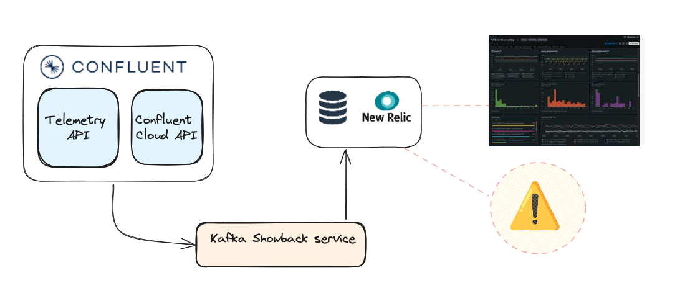

# kafka-showback-demo

KafkaShowbacksDemo split the cost supplied by the Cloud provider by teams/applications. To be aware about the
different costs that we have in our Kafka environments can help to detect problems related with incorrect
configurations.

KafkaShowbacksDemo works with Kafka Confluent environment due that the Confluent Cloud provide a complete set of API to
get the information that we need to calculate the costs. The costs calculated are sent to NewRelicDB.

## Service account format

As in the introduction has been mentioned one of the goals of this KafkaShowBackDemo service is assign the different
costs
to the different teams. To do it, we need to identify the team and application that is assigned to each service account.
We have solved this problem assigning a description with a determinate format, and thanks to this format we can have
this
match between the service account and the team/application. So is mandatory that the description of service account has
the following format:

"Service account for the {CLUSTER},{TEAM},{APPLICATION} application"

## Handle duplicate data

KafkaShowBacks demo service not handle the duplicate records when generate the data to NewRelic event, so in case that
you have generated duplicate or incorrect data you have to remove manually. To do it you can
use [Drop data using NerdGraph](https://docs.newrelic.com/docs/data-apis/manage-data/drop-data-using-nerdgraph/).

## Run locally

### Environment variables

### Demo mode / service mode

## Setup

### Create Confluent cluster with terraform

### Create service account & topics

### Produce data

## Support links

- Confluent:
    - cli
    - tools
    - [Service accounts](https://docs.confluent.io/cloud/current/access-management/identity/service-accounts.html)
- Terraform
- [Drop data using NerdGraph](https://docs.newrelic.com/docs/data-apis/manage-data/drop-data-using-nerdgraph/)

