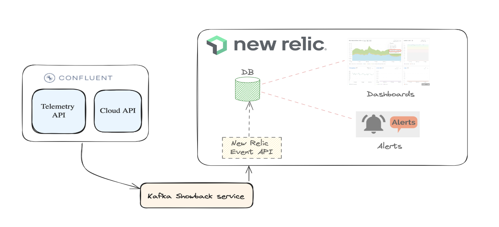

# kafka-showback-demo

KafkaShowbacksDemo split the cost supplied by the Cloud provider by teams/applications. To be aware about the
different costs that we have in our Kafka environments can help to detect problems related with incorrect
configurations.

KafkaShowbacksDemo works with Kafka Confluent environment due that the Confluent Cloud provide a complete set of API to
get the information that we need to calculate the costs. The costs calculated are sent to NewRelicDB.

## Service account format

As in the introduction has been mentioned one of the goals of this KafkaShowBackDemo service is assign the different
costs
to the different teams. To do it, we need to identify the team and application that is assigned to each service account.
We have solved this problem assigning a description with a determinate format, and thanks to this format we can have
this
match between the service account and the team/application. So is mandatory that the description of service account has
the following format:

"Service account for the {CLUSTER},{TEAM},{APPLICATION} application"

## Handle duplicate data

KafkaShowBacks demo service not handle the duplicate records when generate the data to NewRelic event, so in case that
you have generated duplicate or incorrect data you have to remove manually. To do it you can
use [Drop data using NerdGraph](https://docs.newrelic.com/docs/data-apis/manage-data/drop-data-using-nerdgraph/).

## Run locally

### Environment variables

To run the KafkaShowBacksService is mandatory se this environment variables of update the configuration
in [server.yml](src/main/resources/server.yml).

- Confluent environment:
  - CONFLUENT_CLUSTER_LIST: ClusterId list with format [x,x,x]. This parameter is mandatory and has to include all the
    Confluent clustersId that you want to obtain the cost.
  - [Confluent authentication](https://docs.confluent.io/cloud/current/access-management/authenticate/api-keys/api-keys.html#create-a-resource-api-key):
    - CONFLUENT_API_KEY
    - CONFLUENT_API_SECRET
  - Confluent APIs:
    - [CONFLUENT_BILLING_URL](https://docs.confluent.io/cloud/current/api.html#tag/Costs-(billingv1))
    - [CONFLUENT_SERVICE_ACCOUNT_URL](https://docs.confluent.io/cloud/current/api.html#tag/Service-Accounts-(iamv2))
    - [CONFLUENT_TELEMETRY_URL](https://api.telemetry.confluent.cloud/docs/descriptors/datasets/cloud)

- NewRelic:
  - [NR_ACCOUNT_ID](https://docs.newrelic.com/docs/accounts/accounts-billing/account-structure/account-id/)
  - [NR_CUSTOM_EVENT_API_URL](https://docs.newrelic.com/docs/data-apis/ingest-apis/event-api/introduction-event-api/)
  - [NR_LICENSE_API_KEY](https://docs.newrelic.com/docs/apis/intro-apis/new-relic-api-keys/)

### Days to execute

By default, the KafkaShowBacksDemo service calculates the cost for the day before of the execution. You could launch the
service to get the cost for more days changing the daysToExecute parameter
in [server.yml](src/main/resources/server.yml) calculates more than 1 day before. Take into account that Confluent API
has a
limitation of 7 days before, so it's not possible to obtain the cost for more than 7 days.

## Build Confluent environment with terraform

In template folder you can find a set of template to build a Confluent environment with terraform, in the case that you
need it:

- [Create dedicated cluster with terraform.](templates/create_cluster.tf)
- [Create services account and Key API with](templates/create_sa.sh)
- [Create topics](templates/create_topics.sh)
- [Example of service account configuration file](templates/config_sa.properties)
- [Script to generate data with different configurations](templates/generate_data_test.sh)

## Support links

- Confluent:
  - [Kafka command cli](https://docs.confluent.io/confluent-cli/current/overview.html)
  - [Kafka tools](https://docs.confluent.io/kafka/operations-tools/kafka-tools.html)
  - [Create a resource API Key](https://docs.confluent.io/cloud/current/access-management/authenticate/api-keys/api-keys.html#create-a-resource-api-key)
  - [Service accounts](https://docs.confluent.io/cloud/current/access-management/identity/service-accounts.html)
- [Confluent Terraform provider](https://www.confluent.io/blog/confluent-terraform-provider-intro/?ajs_aid=81ed1b46-7507-4e17-acb4-e91a1aa4b742&ajs_uid=870042)
- [Drop data using NerdGraph](https://docs.newrelic.com/docs/data-apis/manage-data/drop-data-using-nerdgraph/)

